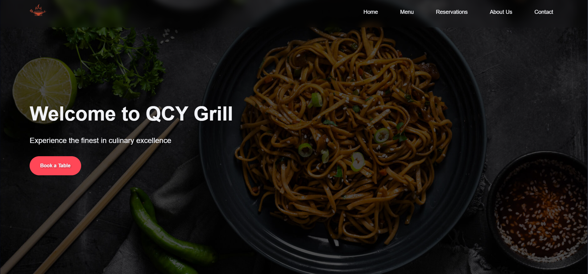

# QCY_Grill_Reasto_Bar
Restaurant website
<div align="center">
  
  
  
  

  <br />
  <br />

  <h2 align="center">QCY Grill Reasto Bar</h2>

  QCY is a fully responsive restaurant website, <br />Responsive for all devices, build using HTML, CSS, and JavaScript.

  <a href="https://qcy-grill-reasto-bar.vercel.app/home.html"><strong>➥ Live Demo</strong></a>

</div>

<br />

### Demo Screeshots



### Prerequisites

Before you begin, ensure you have met the following requirements:

* [Git](https://git-scm.com/downloads "Download Git") must be installed on your operating system.

### Run Locally

To run **QCY_Grill_Reasto_Bar** locally, run this command on your git bash:

Linux and macOS:

```bash
sudo git clone https://github.com/r3dc0dez/QCY_Grill_Reasto_Bar.git
```

Windows:

```bash
git clone https://github.com/r3dc0dez/QCY_Grill_Reasto_Bar.git
```

### Contact

If you want to contact with me you can reach me on [Discord](https://discord.com/users/711836957201793056).

### License

[MIT](https://choosealicense.com/licenses/mit/)
